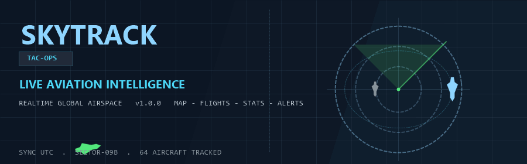
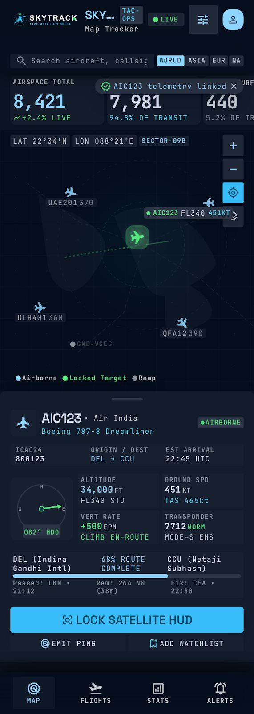
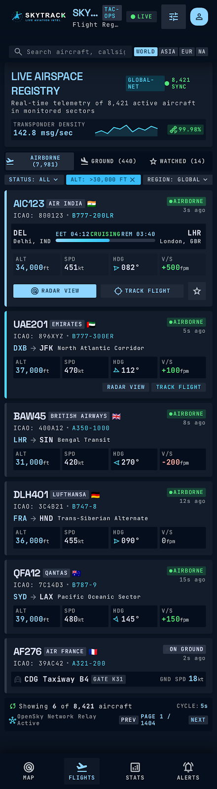
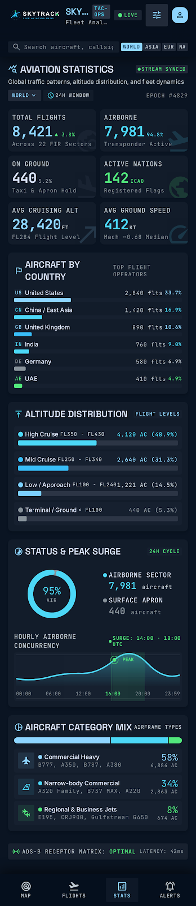
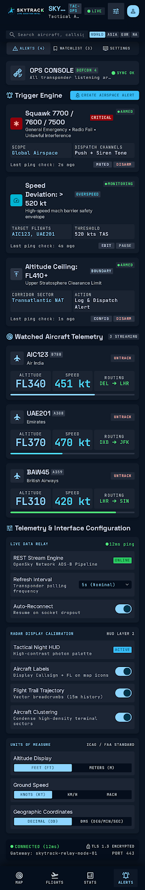

<p align="center">
  
</p>

<h1 align="center">SKYTRACK</h1>

<p align="center">
  Live aviation-intelligence &amp; air-traffic monitoring dashboard.
  <br />
  A tactical HUD for tracking aircraft in real time — built with <b>Expo SDK 54</b> and <b>React Native</b>.
</p>

<p align="center">
  
  
  
  
  
</p>


---

## Table of Contents

- [Overview](#overview)
- [Screenshots](#screenshots)
- [Features](#features)
- [Tech Stack](#tech-stack)
- [Architecture](#architecture)
- [Data Feed: Live & Simulated](#data-feed-live--simulated)
- [Getting Started](#getting-started)
- [Configuration](#configuration)
- [Design System](#design-system)
- [Project Structure](#project-structure)
- [Roadmap](#roadmap)
- [License](#license)

---

## Overview

**SKYTRACK** is a real-time aircraft fleet tracker styled as an air-traffic control workstation. It tracks aircraft across the globe on an interactive map, streams their live telemetry (altitude, ground speed, vertical rate, heading, transponder/squawk), and automatically raises tactical alerts for emergencies and violations.

The UI is a **"Tactical Glassmorphic HUD"** — dark navies, cyan/emerald electro accents, and monospace telemetry typography — modeled after an ops-dispatcher console.

> No API key required. SKYTRACK ships with a built-in **simulated aircraft feed** (60+ planes moving along real world routes) so every screen is fully functional out of the box. Add a feed API key at any time to switch to live global ADS-B traffic.

---

## Screenshots

| MAP — Real-time Radar | FLIGHTS — Aircraft Registry |
| :---: | :---: |
|  |  |

| STATS — Fleet Analytics | ALERTS — Tactical Alerts |
| :---: | :---: |
|  |  |

---

## Features

### 🗺 MAP — Interactive Tactical Map
- Real geographic map (`react-native-maps`) with a custom **dark tile style** that matches the SKY design system.
- Live aircraft markers at true coordinates:
  - **Cyan** — airborne, rotated to heading
  - **Gray** — on the ground / ramp (ADS-B inactive)
  - **Green ring + dot** — locked target
- Zoom in/out controls and a **fly-to-target** button.
- HUD overlay with live latitude/longitude in **DMS** at the map center.
- Legend (Airborne / Locked Target / Ramp) and ambient map-frame dressing.
- **Telemetry sheet** for the selected aircraft:
  - Callsign, airline, aircraft type, ICAO24, origin → destination, ETA
  - Compass heading gauge
  - Altitude (FT + flight level), ground speed (KT), vertical rate (FPM), transponder (MODE-S)
  - Emergency squawk detection (7700 / 7600 / 7500)
  - Route progress strip with % sector complete

### ✈️ FLIGHTS — Aircraft Registry
- Searchable registry of every tracked aircraft.
- Segment filters: **Airborne / Ground / Watched**.
- Per-aircraft telemetry cards with gauges, route arrows, and progress bars.

### 📊 STATS — Fleet Analytics
- Live snapshot of the sector: **airborne vs ground** donut chart.
- Aggregate altitude-band distribution, top countries by traffic, traffic-curve sparkline, and aircraft category mix (**HEAVY / NARROW / REGIONAL**).

### 🚨 ALERTS — Tactical Alert Engine
- Automatic triggers:
  - **Emergency squawk** 7700 / 7600 / 7500
  - **Overspeed** above 520 KT
  - **Altitude ceiling** over FL410
- Watchlist for prioritized tracking.
- Settings: unit selectors (FEET/METERS, KT/KM/H/MACH, DD/DMS) and display toggles.

---

## Tech Stack

| Layer | Choice |
| --- | --- |
| Framework | [Expo SDK 54](https://docs.expo.dev/versions/v54.0.0/) |
| Runtime | React Native 0.81.5 (New Architecture) |
| UI | React 19, `react-native-svg`, `@expo/vector-icons` |
| Navigation | `expo-router` (file-based) v6 with typed routes |
| Maps | `react-native-maps` (custom dark style) |
| Language | TypeScript (strict) |
| Data | AirLabs & Aviationstack REST APIs + built-in simulator |
| Fonts | Space Grotesk, Inter, JetBrains Mono |

---

## Architecture

- **Singleton feed** — `lib/feed.ts` runs one shared polling loop (60s interval) and fans data out to every mounted screen via a listener set, so all tabs stay in sync without duplicate network calls.
- **Provider adapters** — `lib/aviation.ts` normalizes AirLabs and Aviationstack responses into a single `LiveFlight` model (unit conversions include km/h→kt, m→ft, m/s→fpm).
- **Offline-first fallback** — `lib/simulator.ts` generates 60+ realistic flights on real world routes (LAX→JFK, LHR→DXB, …) with climb/cruise/descent phases, grounded aircraft, and emergency squawks. The feed seamlessly falls back to it when no API key is configured or the live feed errors.

```
                    ┌─────────────────────────────┐
                    │    lib/feed.ts (singleton)   │
                    │  poll every 60s · cached ·   │
                    │  emits to all listeners      │
                    └─────────────┬───────────────┘
                                  │ LiveFlight[]
        ┌─────────────┬───────────┼───────────┬─────────────┐
        ▼             ▼           ▼           ▼             ▼
    MAP tab       FLIGHTS      STATS tab    ALERTS tab    (future)
   (index.tsx)      tab          (stats.tsx) (alerts.tsx)
```

---

## Data Feed: Live & Simulated

| Mode | When | Provider |
| --- | --- | --- |
| **Simulated** | No API key set, or live feed fails | `lib/simulator.ts` — 60+ synthetic aircraft over real routes, animated with time |
| **Live** | `EXPO_PUBLIC_SKYTRACK_API_KEY` set | [AirLabs](https://airlabs.co) `v9/flights` (default) or [Aviationstack](https://aviationstack.com) `v1/flights` |

Switching providers is a one-line `.env` change (see [Configuration](#configuration)). The app UI always labels the feed as `AIRLABS V9`, `AVIATIONSTACK V1`, or `SIMULATED FEED`.

---

## Getting Started

### Prerequisites
- Node.js 18+ and npm
- Expo Go on a physical device, or an iOS simulator / Android emulator

### Install & run

```sh
# 1. Install dependencies
npm install

# 2. Start the dev server
npx expo start

# 3. Open on your target platform
#    i  → iOS simulator        a → Android emulator
#    Scan the QR with Expo Go for a physical device
```

### Run standalone builds

```sh
npm run android   # or: npm run ios
```

> **Maps note:** `react-native-maps` works immediately in **Expo Go**. If you ship a standalone binary and want Google Maps (instead of the platform default), add a Google Maps API key to `app.json` under `android.config.googleMaps` / `ios.config.googleMapsApiKey` — see the [Expo SDK 54 maps docs](https://docs.expo.dev/versions/v54.0.0/sdk/map-view/#deploy-app-with-google-maps).

---

## Configuration

All feed configuration lives in a local `.env` file (copy `.env.example`):

```sh
# Provider: airlabs | aviationstack
EXPO_PUBLIC_SKYTRACK_PROVIDER=airlabs

# Your AirLabs or Aviationstack API key (leave empty to use the simulated feed)
EXPO_PUBLIC_SKYTRACK_API_KEY=your-api-key-here
```

Environment variables are inlined at build time by Expo (`EXPO_PUBLIC_*`). `.env` is git-ignored so keys never leak into the repository.

---

## Design System

The entire visual language is codified as tokens in `constants/theme.ts` (derived from `stitch_skytrack_live_aviation_intelligence/DESIGN.md`):

- **Surfaces** — deep navy scale from `#050e1c` to `#2c3545`
- **Accents** — primary `#8ed5ff`, secondary `#4cd7f6`, tertiary `#52e87c`
- **Status** — live `#22c55e`, alert `#f59e0b`, critical `#ef4444`
- **Typography** — Space Grotesk (display/HUD), Inter (body), JetBrains Mono (telemetry)
- **Radii & spacing** — base-4 spacing scale, monotone radii

Dress codes like **TAC-OPS**, **SECTOR-09B**, **DEFCON 4** and **MODE-S EHS** give the UI an ops-dispatcher feel.

---

## Project Structure

```
SKYTRACK1/
├── app/                        # expo-router file-based routes
│   ├── _layout.tsx             # Root stack + theme + font loading
│   └── (tabs)/
│       ├── _layout.tsx         # Custom bottom tab bar (MAP / FLIGHTS / STATS / ALERTS)
│       ├── index.tsx           # 🗺 MAP — Radar + telemetry sheet
│       ├── flights.tsx         # ✈️ FLIGHTS — Aircraft registry
│       ├── stats.tsx           # 📊 STATS — Fleet analytics
│       └── alerts.tsx          # 🚨 ALERTS — Trigger engine + settings
├── components/
│   └── skytrack/
│       ├── header.tsx          # Sticky tactical header + UTC clock
│       ├── screen.tsx          # SafeArea + header + scroll layout shell
│       ├── radar-map.tsx       # react-native-maps radar (map + markers + HUD)
│       ├── charts.tsx          # SVG charts (sparkline, donut, compass, traffic)
│       └── ui.tsx              # Design-system primitives (icon, pills, toggles…)
├── lib/
│   ├── aviation.ts             # LiveFlight model + AirLabs/Aviationstack adapters
│   ├── feed.ts                 # Shared singleton polling feed
│   └── simulator.ts            # Built-in synthetic aircraft feed
├── constants/theme.ts          # SKY design tokens
├── screenshots/                # README screenshots
├── stitch_skytrack_…/          # Design-time HTML mockups & DESIGN.md
├── .env.example                # Feed configuration template
├── app.json                    # Expo app config
└── tsconfig.json               # TypeScript (strict)
```

---

## Roadmap

- [ ] Aircraft callout labels + trailing flight-path polylines on the map
- [ ] Pneumatic-style clustering for high-density sectors
- [ ] Favorite airports / saved sectors with alerts
- [ ] Weather & wind overlay layers
- [ ] E2E tests with Maestro / Detox

---

## License

Released under the [MIT License](LICENSE).
